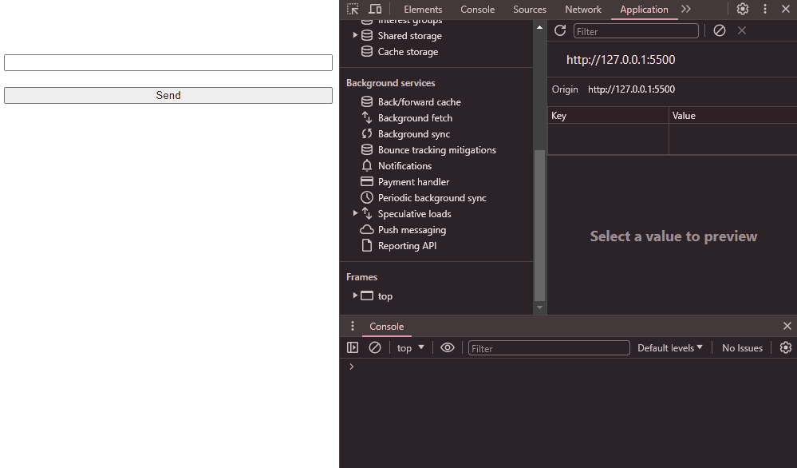

# AOAI Sample App

This Node.js application demonstrates the integration of Azure OpenAI API to leverage powerful AI models in your Node.js applications. This project can serve as a foundation for building more complex applications or as a learning tool for working with Azure OpenAI.


## Features

- **Azure Authentication**: Securely authenticate with Azure to access OpenAI services.
- **Azure OpenAI API Usage**: Examples of using various Azure OpenAI APIs.


## Environment Variables

To run this project, you will need to add the following environment variables to your .env  file and local.setings.json for running Azure Function. See samples in `/samplejs/sample.env` and `api/sample-local.settings.json` respectively. 

- `AZURE_OPENAI_API_KEY`

- `AZURE_OPENAI_ENDPOINT`


## Run Locally

Clone the project

```bash
  git clone https://github.com/shan-debug/sample-app-aoai.git
```

Go to the project directory

```bash
  cd sample-app-aoai
  cd api
```

Install dependencies

```bash
  npm install
```

Start the server

```bash
  func start
```

Open `index.html`

To checkout sample scripts in `samplejs`, go back to `<root>` directory and run the ff:
```bash
  npm install
  cd samplejs
  node <filename>
```  


## Demo


## Lessons Learned

What did you learn while building this project? 
- To make use of AOAI tools feature (i.e. `code interpreter`, `function calls`, `retrieval` ) you have to use assistants API
- The AOAI `completion` API can take an array of messages from with various roles and use it as context to return a response, while `assistants` can only take array of messages as long as the role defined is a `user`

What challenges did you face and how did you overcome them?

I had trouble using a different model other than `<gpt-4>` when using `@azure/openai-assistants` SDK.

I concluded it was an issue with the SDK, because when I tried using REST it worked.

